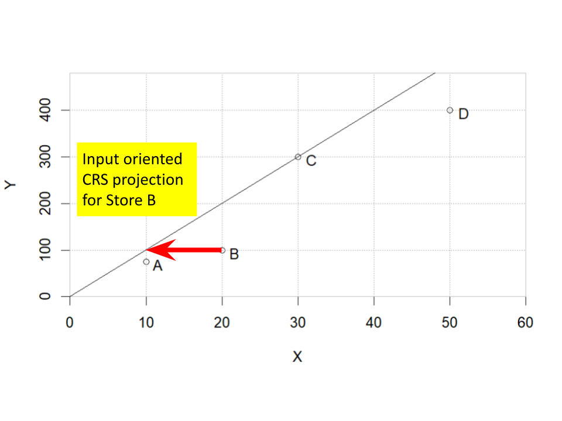
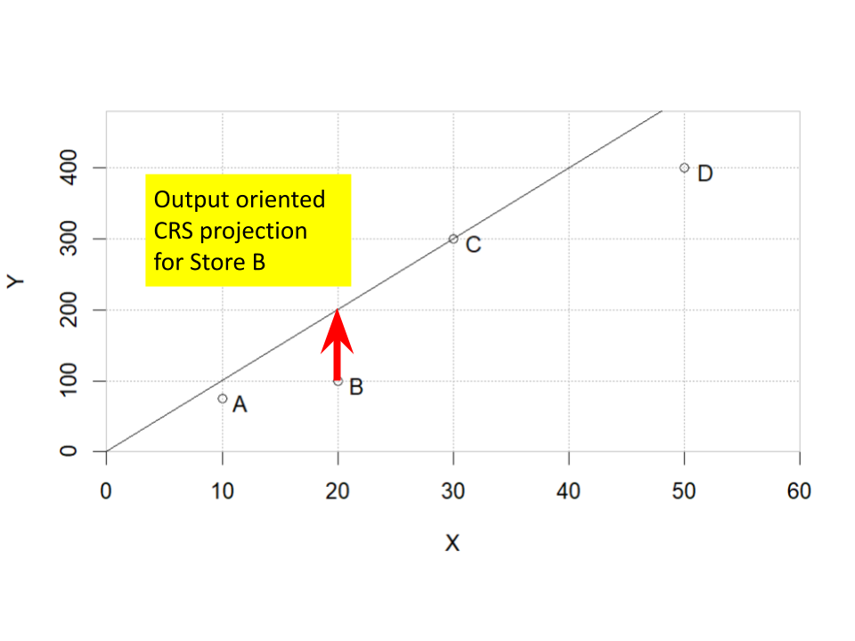

# Other Orientations

## Introduction

```{r, include=FALSE, eval=FALSE}
library(bookdown); library(rmarkdown); rmarkdown::render("04-OO_Env.Rmd", "pdf_book")
```

In chapters 2 and 3 we focused on the input-oriented envelopment model. This chapter will focus on the output-oriented model before moving on to a slack-based model sometimes referred to as a non-oriented model.

The input and output-oriented models are the most commonly used for DEA applications. People can sometimes be confused over when to use an input-oriented or an output-oriented model. Think of input-oriented as *input-reducing* and output-oriented as *output increasing*. In an input-oriented model, the primary goal is to reduce the input while not sacrificing any output. In contrast, the primary goal for an output-oriented model is to increase the output while not increasing the usage of any input.

## Output-Oriented Model

Think of selecting the model orientation by looking at a simple model of say, a set of restaurants where the input the input is labor and the output is customers served. The question than is what do the managers have more control over. If managers of restaurants have the opportunity to serve more customers and have many customers trying to get reservations but are unable to be accommodated, perhaps an output-oriented model is best. On the other hand, they have may have weak influence over the number of customers served, perhaps due to advertising being done at a regional level. In this case, perhaps cost control is the primary goal which means that an input-oriented model should be applied to emphasize reducing labor.

```{r Fig-Orientation-Projections, echo=FALSE, out.width="45%", fig.show='hold', fig.align='center',fig.cap="Input vs. Output Orientations", fig.show='hold'}


```

### Output-Oriented Formulation

The linear program for the output-oriented model is very similar to that of the input-oriented model. The major change now is that rather than finding the minimum level of input capable of producing the desired output, the goal is to find the maximum output without reducing the input. This expansion of output is denoted as $\phi$ and the resulting constant returns to scale model is given below.

$$
 \begin{aligned}
    \text{max  }   & \phi \\
    \text{s.t.:  } & \sum_{j=1}^{n} x_{i,j}\lambda_j \leq  x_{i,k} \; \forall \; i\\
                       & \sum_{j=1}^{n} y_{r,j}\lambda_j \geq  \phi y_{r,k} \;  \forall \; r\\
                       & \lambda_j \geq 0  \; \forall \; j
  \end{aligned}
$$

The value $\phi$ is a radial expansion that unit *k* is expected to make on every output whereas in the input-oriented model, $\theta$ was a radial reduction for every input. A very inefficient unit that received an input-oriented, constant returns to scale efficiency score of $\theta=0.5$ indicates that it should be able to achieve the same output it is currently producing using no more than half of any input. If the same analysis were done using an output-orientation, the unit would get a score of $\phi=2.0$ indicating that using the current input, the unit should at least double each output. In the case of constant returns to scale, the efficiency scores will be consistent ($\theta$=$\frac{1}{\phi}$) but targets will be different. Under other returns to scale assumptions, this relationship between $\theta$ and $\phi$ generally does not hold. The result is that the orientation can have a significant impact on efficiency scores, targets of performance, and who is used to in the developing performance targets for inefficient units.

Just as we did in chapter 2 for the input-oriented model, we will transform it to standard form by moving all terms with variables to the left-hand side.

$$
 \begin{aligned}
    \text{max  }   & \phi \\
    \text{s.t.:  } & \sum_{j=1}^{n} x_{i,j}\lambda_j \leq x_{i,k} \; \forall \; i\\
                       & \sum_{j=1}^{n} y_{r,j}\lambda_j - \phi y_{r,k}  \; \geq 0 \forall \; r\\
                       & \lambda_j \geq 0  \; \forall \; j
  \end{aligned}
$$

Now we will convert the problem input and output constraints from inequalities into equalities by explicitly defining slack variables.

$$
 \begin{aligned}
    \text{max  }   & \phi \\
    \text{s.t.  } & \sum_{j=1}^{n} x_{i,j}\lambda_j  + s^x_i =  x_{i,k}  \; \forall \; i\\
                       & \sum_{j=1}^{n} y_{r,j}\lambda_j - \phi y_{r,k} - s^y_r = 0 \; \forall \; r\\
                       & \lambda_j , s^x_i, s^y_r \geq 0  \; \forall \; i,r,j
  \end{aligned}
$$

### Output-Oriented Linear Program Implementation

As usual, we will start with loading a collection of packages.

```{r  message=FALSE, warning=FALSE}
     # options: message=FALSE, warning=FALSE to turn off display
library (kableExtra)       # Nicely formatted tables
library (ROI)              # R Optimization Interface package
library (ROI.plugin.glpk)  # Connection to glpk as solver
library (ompr)             # Optimization Modeling Package
library (ompr.roi)         # Connective tissue
library (TRA)
```

Let's revisit our four store, single-input, single-output grocery store example.

```{r Creating-data-structures, echo=FALSE}

x <- matrix(c(10,20,30,50),ncol=1, 
            dimnames=list(LETTERS[1:4],"x"))
y <- matrix(c(75,100,300,400),ncol=1,
            dimnames=list(LETTERS[1:4],"y"))

NX <- ncol(x); NY <- ncol(y); ND <- nrow(x)
xdata<-x[1:ND,] ; dim(xdata)<-c(ND,NX) 
ydata<-y[1:ND,] ; dim(ydata)<-c(ND,NY)

storenames<- c("Al\'s Pantry", "Bob\'s Mill", 
               "Trader Carrie\'s", "Dilbertson\'s")
temp<-cbind(storenames,x,y)
colnames(temp)<-c("Store Name", "Employees (x)", "Sales (y)")
kbl (temp, booktabs=T, escape=F,
     caption="First Dataset for DEA") |>
  kable_styling(latex_options = "hold_position")
```

Let's refresh our memory with the input-output data for the example.

Now the formulation is similar to the input-oriented model that we created in chapter 2. The three changes are that we will be using $\phi$ rather than $\theta$, a *max* rather than *min* objective function, and modifying the output-constraint(s) rather than the input-constraint(s).

```{r OO-4Store-CRS}
res4_1.efficiency <- matrix(rep(-1.0, 1), nrow=ND, ncol=1)
res4_1.lambda     <- matrix(rep(-1.0, ND), nrow=ND,ncol=ND)

RTS<-"CRS"
for (k in 1:ND) {
  
  result <- MIPModel()                                              |>
    add_variable(vlambda[j], j = 1:ND, type = "continuous", lb = 0) |>
    add_variable(vphi, type = "continuous")                         |>
    set_objective(vphi, "max")                                      |>
    add_constraint(sum_expr(vlambda[j] * xdata[j,i], j = 1:ND) 
                   <=  xdata[k,i], i = 1:NX)                        |>
    add_constraint(sum_expr(vlambda[j] * ydata[j,r], j = 1:ND) 
                   >= vphi * ydata[k,r], r = 1:NY) 

    if (RTS=="VRS") {result <- add_constraint(result, 
                 sum_expr(vlambda[j],j = 1:ND) == 1) }  #RTS

res4_1<-   solve_model(result, with_ROI(solver = "glpk")) 
    
    res4_1.efficiency[k] <-  get_solution(res4_1, vphi)       
    res4_1.lambda[k,] <- t(as.matrix(as.numeric(
                     get_solution(res4_1, vlambda[j])[,3] )))
}
res4_1.combined <- cbind(res4_1.efficiency, res4_1.lambda)
```

```{r}
res4_1.names <- TRA::DEAnames(NX, NY, ND)

rownames(res4_1.combined)<-res4_1.names$DMUnamesbyletter
kbl(res4_1.combined, 
    booktabs=T, digits=3, escape=F, 
    col.names=c("$\\phi^{CRS}$", res4_1.names$LambdanamesbyletterLX),
    caption= 'Output-Oriented Envelopment Analysis for Stores') |>
  kable_styling(latex_options = "hold_position")
```

Let's compare the results with those from Chapter 2's input-oriented analysis.

```{r, echo=FALSE}
res4_2.efficiency <- matrix(rep(-1.0, 1), nrow=ND, ncol=1)
res4_2.lambda     <- matrix(rep(-1.0, ND), nrow=ND,ncol=ND)

RTS<-"CRS"
for (k in 1:ND) {
  
  mod4_2 <- MIPModel()                                              |>
    add_variable(vlambda[j], j = 1:ND, type = "continuous", 
                 lb = 0)                                            |>
    add_variable(vtheta, type = "continuous")                       |>
    set_objective(vtheta, "min")                                    |>
    add_constraint(sum_expr(vlambda[j] * xdata[j,i], j = 1:ND) 
                   <= vtheta * xdata[k,i], i = 1:NX)                |>
    add_constraint(sum_expr(vlambda[j] * ydata[j,r], j = 1:ND) 
                   >= ydata[k,r], r = 1:NY) 

  if (RTS=="VRS") 
    {mod4_2 <- add_constraint(mod4_2, 
                              sum_expr(vlambda[j], j = 1:ND) == 1) 
    }  #Returns to Scale

  res4_2 <-   solve_model(mod4_2, with_ROI(solver = "glpk")) 
    
  res4_2.efficiency[k] <-  get_solution(res4_2, vtheta)       
  res4_2.lambda[k,] <- t(as.matrix(as.numeric(
    get_solution(res4_2, vlambda[j])[,3] )))
}  # Repeat for each unit, k
```

```{r}
temp <- cbind(res4_1.efficiency, 1/res4_1.efficiency,
              res4_2.efficiency)
rownames(temp)<-res4_1.names$DMUnamesbyletter

kbl(cbind(temp), 
    booktabs=T, digits=3, escape=F, 
    col.names=c("$\\phi^{CRS}$", "$\\frac{1}{\\phi^{CRS}}$",
                "$\\theta^{CRS}$"),
    caption= 'Input vs. Output Orientation Under CRS') |>
  kable_styling(latex_options = "hold_position")
```

### Output-Oriented Variable Returns to Scale

Let's now change to Variable Returns to Scale.

```{r OO-4Store-VRS, echo=FALSE}
res4_3.efficiency <- matrix(rep(-1.0, 1), nrow=ND, ncol=1)
res4_3.lambda     <- matrix(rep(-1.0, ND), nrow=ND,ncol=ND)

RTS<-"VRS"
for (k in 1:ND) {
  
  result <- MIPModel()                                              |>
    add_variable(vlambda[j], j = 1:ND, type = "continuous", lb = 0) |>
    add_variable(vphi, type = "continuous")                         |>
    set_objective(vphi, "max")                                      |>
    add_constraint(sum_expr(vlambda[j] * xdata[j,i], j = 1:ND) 
                   <=  xdata[k,i], i = 1:NX)                        |>
    add_constraint(sum_expr(vlambda[j] * ydata[j,r], j = 1:ND) 
                   >= vphi * ydata[k,r], r = 1:NY) 

    if (RTS=="VRS") {result <- add_constraint(result, 
                 sum_expr(vlambda[j],j = 1:ND) == 1) }  #Returns to Scale

res4_3<-   solve_model(result, with_ROI(solver = "glpk")) 
    
    res4_3.efficiency[k] <-  get_solution(res4_3, vphi)       
    res4_3.lambda[k,] <- t(as.matrix(as.numeric(
                     get_solution(res4_3, vlambda[j])[,3] )))
}
res4_3.combined   <- cbind(res4_3.efficiency, res4_3.lambda)
```

```{r, echo=FALSE}
res4_4.efficiency <- matrix(rep(-1.0, 1), nrow=ND, ncol=1)
res4_4.lambda     <- matrix(rep(-1.0, ND), nrow=ND,ncol=ND)

RTS<-"CRS"
for (k in 1:ND) {
  
  mod4_4 <- MIPModel()                                              |>
    add_variable(vlambda[j], j = 1:ND, type = "continuous", 
                 lb = 0)                                            |>
    add_variable(vtheta, type = "continuous")                       |>
    set_objective(vtheta, "min")                                    |>
    add_constraint(sum_expr(vlambda[j] * xdata[j,i], j = 1:ND) 
                   <= vtheta * xdata[k,i], i = 1:NX)                |>
    add_constraint(sum_expr(vlambda[j] * ydata[j,r], j = 1:ND) 
                   >= ydata[k,r], r = 1:NY) 

  if (RTS=="VRS") 
    {mod4_4 <- add_constraint(mod4_4, 
                              sum_expr(vlambda[j], j = 1:ND) == 1) 
    }  #Returns to Scale

  res4_4 <-   solve_model(mod4_4, with_ROI(solver = "glpk")) 
    
  res4_4.efficiency[k] <-  get_solution(res4_4, vtheta)       
  res4_4.lambda[k,] <- t(as.matrix(as.numeric(
    get_solution(res4_4, vlambda[j])[,3] )))
}  # Repeat for each unit, k
```

```{r}
temp <- cbind(res4_3.efficiency, 1/res4_3.efficiency,
              res4_4.efficiency)
rownames(temp)<-res4_1.names$DMUnamesbyletter

kbl(cbind(temp), 
    booktabs=T, digits=3, escape=F, 
    col.names=c("$\\phi^{VRS}$", "$\\frac{1}{\\phi^{VRS}}$",
                "$\\theta^{VRS}$"),
    caption= 'Input vs. Output Orientation Under VRS') |>
  kable_styling(latex_options = "hold_position")
```

Key takeaways about the impact of orientation:

-   Changing a model from input-orientation to output-orientation will not change which units are efficient.
-   Changing a model from input-orientation to output-orientation under CRS results in consistent results but different projections.
-   Changing a model from input-orientation to output-orientation under other returns scale may change the relative rankings of inefficient units.

## Slack Based Models

We have focused on radial efficiency scores up to this point. The primary emphasis is on proportionally decreasing the inputs (input-orientation) or increasing the outputs (output-orientation). The decision of input versus output-orientation is then very important. Also, radial models generally use a second phase of slack maximization to form targets of best practices.

Rather than dealing with slacks at the end and in a second phase, another approach is to use it directly at the beginning. It is called the slack-based model.

The simplest slack based model would be to simply use a variation of the second phase of the two phase model presented in Chapter 2. Let's use a CRS case.

$$
\begin{split}
 \begin{aligned}
    \text{max    } & \sum_{i}s^x_i + \sum_{r}s^y_r\\
    \text{s.t.:  } & \sum_{j=1}^{N^D} x_{i,j}\lambda_j  + s^x_i = x_{i,k} \; \forall \; i\\
                   & \sum_{j=1}^{N^D} y_{r,j}\lambda_j - s^y_r =  y_{r,k} \; \forall \; r\\
                   & \lambda_j , \; s^x_i, \; s^y_r \geq 0  \; \forall \; j,\; i,\; r
  \end{aligned}
\end{split}
$$

### Store Example of Slack-Based Model

Let's revisit our grocery store example with seven stores again.

```{r, echo=FALSE}
x <- matrix(c(10, 20, 30, 50, 22, 29, 35,
              75, 100, 220, 480, 290, 210, 220), byrow=FALSE, ncol=2, 
            dimnames=list(LETTERS[1:7],c("x1","x2")))
y <- matrix(c(75,100,300,400, 280, 120, 300),ncol=1,
            dimnames=list(LETTERS[1:7],"y"))

storenames<- c("Al\'s Pantry", "Bob\'s Mill", 
               "Trader Carrie\'s", "Dilbertson\'s",
               "Ed\'s Eggshop", "Flo\'s Farmacopia", "Gary\'s Grocery")
temp<-cbind(storenames,x,y)
colnames(temp)<-c("Store Name", "Employees (x1)", "Floor Space (x2)", "Sales (y)")
kbl (temp, booktabs=TRUE)
NX <- ncol(x); NY <- ncol(y); ND <- nrow(x)
store7names <- TRA::DEAnames(NX, NY, ND)
```

```{r CRS2PhaseIO}
CRS2PhaseIO.efficiency <- matrix(rep(-1.0, ND), nrow=ND)
CRS2PhaseIO.lambda     <- matrix(rep(-1.0, ND*ND), nrow=ND,ncol=ND)
CRS2PhaseIO.xslack    <- matrix(rep(-1.0, ND*NX), nrow=ND,ncol=NX) 
CRS2PhaseIO.yslack    <- matrix(rep(-1.0, ND*NY), nrow=ND,ncol=NY) 
xdata<-x
ydata<-y

RTS<-"CRS"
for (k in 1:ND) {
  
  LPSlack <- MIPModel()                                             |>
    add_variable(vlambda[j], j = 1:ND, type = "continuous", lb = 0) |>
    add_variable(vtheta, type = "continuous")                       |>
    add_variable(xslack[i], i = 1:NX, type = "continuous", lb = 0)  |>
    add_variable(yslack[r], r = 1:NY, type = "continuous", lb = 0)  |>
    
    set_objective(vtheta, "min")                                    |>
    
    add_constraint(sum_expr(vlambda[j] * xdata[j,i], 
                            j = 1:ND)+xslack[i] 
                   - vtheta * xdata[k,i]==0, i = 1:NX)              |>
    
    add_constraint(sum_expr(vlambda[j] * ydata[j,r], 
                            j = 1:ND) -yslack[r]
                    ==ydata[k,r], r = 1:NY) 
  
    result1 <-   solve_model(LPSlack, with_ROI(solver = "glpk")) 

    # The following are the key steps to slack maximization 
    phase1obj <-  get_solution(result1, vtheta)  
    # Get Phase 1 objective value

    LPSlack<-add_constraint(LPSlack, vtheta==phase1obj)   
                     # Passing result from phase 1 to phase 2
    
    LPSlack<-set_objective(LPSlack, sum_expr(xslack[i], i=1:NX)
                  + sum_expr(yslack[r], r=1:NY), "max")
              # Modify the objective function for phase 2
    result2 <-   solve_model(LPSlack, with_ROI(solver = "glpk")) 
    CRS2PhaseIO.efficiency[k] <-  get_solution(result2, vtheta)       
    CRS2PhaseIO.lambda[k,] <- t(as.matrix(
                 as.numeric(get_solution(result2, 
                                         vlambda[.])[,3] )))
    CRS2PhaseIO.xslack[k,]  <- t(as.matrix(
                 as.numeric(get_solution(result2, 
                                         xslack[.])[,3] )))
    CRS2PhaseIO.yslack[k,]  <- t(as.matrix(
                 as.numeric(get_solution(result2, 
                                         yslack[.])[,3] )))
    }

CRS2PhaseIO.Res<-cbind(CRS2PhaseIO.efficiency, CRS2PhaseIO.lambda, 
                       CRS2PhaseIO.xslack, CRS2PhaseIO.yslack)
rownames(CRS2PhaseIO.Res) <- store7names$DMUnamesbyletter
```

```{r Slack1}
Slack1.lambda <- matrix(rep(-1.0, ND*ND), nrow=ND,ncol=ND) 
Slack1.xslack <- matrix(rep(-1.0, ND*NX), nrow=ND,ncol=NX) 
Slack1.yslack <- matrix(rep(-1.0, ND*NY), nrow=ND,ncol=NY) 

RTS<-"CRS"
for (k in 1:ND) {
  
  LPSlack <- MIPModel()                                             |>
    add_variable(vlambda[j], j = 1:ND, type = "continuous", lb = 0) |>
    add_variable(xslack[i], i = 1:NX, type = "continuous", lb = 0)  |>
    add_variable(yslack[r], r = 1:NY, type = "continuous", lb = 0)  |>
    
    add_constraint(sum_expr(vlambda[j] * xdata[j,i], 
                            j = 1:ND)+xslack[i] 
                   - xdata[k,i]==0, i = 1:NX)                       |>
    
    add_constraint(sum_expr(vlambda[j] * ydata[j,r], 
                            j = 1:ND) -yslack[r]
                    ==ydata[k,r], r = 1:NY) 
  
    LPSlack<-set_objective(LPSlack, sum_expr(xslack[i], i=1:NX)
                  + sum_expr(yslack[r], r=1:NY), "max")
  
    result2 <-   solve_model(LPSlack, with_ROI(solver = "glpk")) 

    Slack1.lambda[k,] <- t(as.matrix(
                 as.numeric(get_solution(result2, 
                                         vlambda[.])[,3] )))
    Slack1.xslack[k,]  <- t(as.matrix(
                 as.numeric(get_solution(result2, 
                                         xslack[.])[,3] )))
    Slack1.yslack[k,]  <- t(as.matrix(
                 as.numeric(get_solution(result2, 
                                         yslack[.])[,3] )))
    }

Slack1.Res<-cbind(Slack1.lambda, 
                  Slack1.xslack, Slack1.yslack)
rownames(Slack1.Res) <- store7names$DMUnamesbyletter
```

Let's compare the results of our slack based model to the two-phase results from chapter 2.

```{r}
kbl (cbind(CRS2PhaseIO.Res,Slack1.Res), booktabs=T, escape=F, digits=3,
     col.names=c("$\\theta^{CRS}$", store7names$LambdanamesbyletterLX, 
                 store7names$SXnamesLX, store7names$SYnamesLX,
                 store7names$LambdanamesbyletterLX, 
                 store7names$SXnamesLX, store7names$SYnamesLX),
        caption="Slack Maximizing Results from Seven Store")            |>
  kable_styling (latex_options = c("hold_position", "scale_down"))
```

Some important takeaways from these results.

-   First, note that stores C and E are strongly efficient in both models. In the slack based model, C and E are compared only against themselves and have zero slack in all three slack variables.\
-   The slack based model's objective function would simply be the sum of slack in FTE, square meters of floor space, and sales in thousands of dollars.
-   The target for the weakly efficient store, G, is the same for in both analyses.
-   The target is different for the four radially inefficient stores: A, B, D, and F. This corresponds to a different projection.
-   The slack on the second input ($s^x_2$) for store D is almost twenty times higher than that of the slack for any input on any other store.
-   A reminder that the values of input 2 are on the order the order ten times that of the first input. This means that in adding slacks, the second input will tend to have more pull in the objective function.

### Slack Percentages

These observations lead us to consider a couple of options. First, we can convert the sum of slacks to a sum of slack percentages by dividing by each store's actual inputs or outputs.

$$
\begin{split}
 \begin{aligned}
    \text{max    } & \sum_{i} \frac{s^x_i}{x_{i,k}} + \sum_{r}\frac{s^y_r}{y_{r,k}}\\
    \text{s.t.:  } & \sum_{j=1}^{N^D} x_{i,j}\lambda_j  + s^x_i = x_{i,k} \; \forall \; i\\
                   & \sum_{j=1}^{N^D} y_{r,j}\lambda_j - s^y_r =  y_{r,k} \; \forall \; r\\
                   & \lambda_j , \; s^x_i, \; s^y_r \geq 0  \; \forall \; j,\; i,\; r
  \end{aligned}
\end{split}
$$

The $\sum_{i=1}^{N^X} \frac{s^x_i}{x_{i,k}}$ is the sum of all input slacks by percentage. We could convert this to an average slack percentage by dividing by the number of inputs, $N^x$. A value 0% would mean no slacks in any input. Similar things could be done on the output side.

We can use a single metric $\rho$, that can serve as an efficiency score by combining both the average input slack and the output slack.

$$
\rho = \frac {1- \frac {1}{N^x}\sum_{i=1}^{N^X} \frac{s^x_i}{x_{i,k}}}  {1+\frac {1}{N^y}\sum_{r=1}^{N^Y} \frac{s^y_r}{y_{r,k}}}
$$ While it doesn't have the same radial interpretation of both $\theta$ or $\phi$ from the input or output-oriented model, it provides a nice holistic metric that captures inefficiency on both inputs and outputs. A value of $\rho=1.0$ represents an efficient unit. A value of $\rho=0.5$ might be due to an average input slack of 50% on the inputs in a unit that is output efficient. On the other hand, it might also represent a unit that only produces half of what an efficient target produces despite being input efficient. In either case, an overall efficiency of 50% seems warranted. Unfortunately the function for calculating $\rho$ involves dividing functions of variables, $s^x_i$ by functions of other variables, $x^y_r$. This makes it a nonlinear function which is more difficult to optimize.

Let's calculate $\rho$ for each of the stores using the slack based model.

```{r}
rho_numerator1 <- 1 - rowMeans(Slack1.xslack/x)
rho_denominator1 <- 1 + rowMeans (Slack1.yslack/y)
Slack1.rho <- rho_numerator1/rho_denominator1
```

```{r Slack2}
Slack2.lambda <- matrix(rep(-1.0, ND*ND), nrow=ND,ncol=ND) 
Slack2.xslack <- matrix(rep(-1.0, ND*NX), nrow=ND,ncol=NX) 
Slack2.yslack <- matrix(rep(-1.0, ND*NY), nrow=ND,ncol=NY) 

RTS<-"CRS"
for (k in 1:ND) {
  
  LPSlack <- MIPModel()                                             |>
    add_variable(vlambda[j], j = 1:ND, type = "continuous", lb = 0) |>
    add_variable(xslack[i], i = 1:NX, type = "continuous", lb = 0)  |>
    add_variable(yslack[r], r = 1:NY, type = "continuous", lb = 0)  |>
    
    add_constraint(sum_expr(vlambda[j] * xdata[j,i], 
                            j = 1:ND)+xslack[i] 
                   - xdata[k,i]==0, i = 1:NX)              |>
    
    add_constraint(sum_expr(vlambda[j] * ydata[j,r], 
                            j = 1:ND) -yslack[r]
                    ==ydata[k,r], r = 1:NY) 
  
    LPSlack<-set_objective(LPSlack, 
                           sum_expr(xslack[i]/xdata[k,i], i=1:NX)
                           + sum_expr(yslack[r]/ydata[k,r], r=1:NY), 
                           "max")
  
    result3 <-   solve_model(LPSlack, with_ROI(solver = "glpk")) 

    Slack2.lambda[k,] <- t(as.matrix(
                 as.numeric(get_solution(result3, 
                                         vlambda[.])[,3] )))
    Slack2.xslack[k,]  <- t(as.matrix(
                 as.numeric(get_solution(result3, 
                                         xslack[.])[,3] )))
    Slack2.yslack[k,]  <- t(as.matrix(
                 as.numeric(get_solution(result3, 
                                         yslack[.])[,3] )))
    }

Slack2.Res<-cbind(Slack2.lambda, 
                  Slack2.xslack, Slack2.yslack)
rownames(Slack2.Res) <- store7names$DMUnamesbyletter

rho_numerator2 <- 1 - rowMeans(Slack2.xslack/x)
rho_denominator2 <- 1 + rowMeans (Slack2.yslack/y)
Slack2.rho <- rho_numerator2/rho_denominator2
```

```{r, echo=FALSE}
temp <- cbind(CRS2PhaseIO.efficiency, Slack1.rho, Slack1.Res, Slack2.rho,Slack2.Res)
colnames(temp) <- c("$\\theta^{CRS}$", 
                    "$\\rho^{CRS}$", store7names$LambdanamesbyletterLX,
                    store7names$SXnamesLX, store7names$SYnamesLX,
                    "$\\rho^{CRS}$", store7names$LambdanamesbyletterLX,
                    store7names$SXnamesLX, store7names$SYnamesLX)
     
kbl (TRA::poscol(temp, cutoff=0.000001), 
     booktabs=T, escape=F, digits=3,
        caption="Maximizing Slack vs. Slack Percentage")           |>
  kable_styling (latex_options = c("hold_position", "scale_down")) |>
  add_header_above(c(" " = 2, "Sum of Slacks" = 6, 
                     "Sum of Slack Percentages" = 6))
```

```{r, echo=FALSE, eval=FALSE}
kbl (cbind(rho_numerator1, rho_numerator2,
           rho_denominator1, rho_denominator2), 
     booktabs=T, escape=F, 
        caption="Maximizing Slack vs. Slack Percentage") |>
  kable_styling (latex_options = c("hold_position", "scale_down"))

```

The results in the table are interesting:

-   The measures of $\rho$ are relatively robust and consistent with the efficiency scores $\theta$ and $1/\phi$.\
-   For the slack based models, changing the measures from maximizing slacks to slack percentages changed the targets ($\lambda$ values) but not the holistic overall score of $\rho$. This is unlikely to persist in more complex models.
-   The `poscol` function from the `TRA` package was used with a `cutoff` value to eliminate columns of $\lambda$ for inefficient units.
-   The `add_header_above` function from `kableExtra` was used to provide groupings of columns.

A variety of slack-based models have been developed over the years. Returns to scale can be incorporated in the same manner as in traditional input and output-oriented models.
