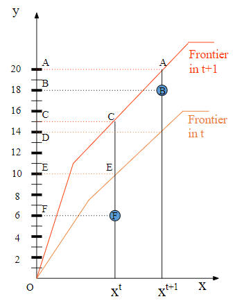
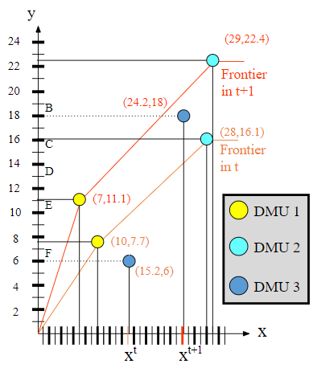

```{r Ch_10_setup, include=FALSE}
knitr::opts_chunk$set(echo = TRUE)
library (pander)
panderOptions ('round',5) # Rounding in pander data tables
library (knitr)
library (DiagrammeR)
library (DiagrammeRsvg)
library (rsvg)
library (htmltools)
library(pander)
panderOptions('round',5) # Rounding in pander data tables
library(TRA)  # Not on CRAN, install from github if needed
   # devtools::install_github("prof-anderson/TRA")
library ("Lahman", quietly=TRUE)
library ("dplyr", quietly=TRUE)
library ("pander", quietly=TRUE)
library (DiagrammeRsvg, quietly=TRUE)
library (rsvg, quietly=TRUE)
library (htmltools, quietly=TRUE)
library (Benchmarking)
library (DJL)
library (deaR)
#library(bookdown); library(rmarkdown); rmarkdown::render("10-Malmquist_Index.Rmd", "pdf_book")
```

# Changing Performance over Time

## Introduction[^malmquist_index-1]

[^malmquist_index-1]: This chapter benefited from significant contributions by Aurobindh Kalathil Puthanpura, Nina Chaichi, Dr. Dong-Joon Lim, and Kevin van Blommestein but responsibility for all errors resides with Dr. Tim Anderson

Often it is important to assess the changing performance over time rather than just at a single snapshot. We did some explorations of the changing distribution of scores in the chapter on baseball but we didn't really explore how these scores change on a year by year basis. A unit's changing performance might be due to a number of reasons:

-   General operating conditions have changed
-   Changing size of operations resulting
-   Incorporated best practices by single unit

In the case of a store being benchmarked against similar stores in the same chain, changes due to general operating conditions might be due to inflation raising wages (or materials, end products, etc.), changing laws or regulations, etc. In this case, a change in the general operating conditions is like "...a rising tide raising all boats." It is good to identify and quantify these impacts but it isn't something that an individual store manager would be either blamed for performance loss due to this or praised for changes helping. (A similar example could be found for stock traders, making a 20% return when the market is also up 20% is not particularly impressive and getting a 15% return might be considered poor.)

Performance may be improved by simply getting bigger and achieving economies of scale. Perhaps a store expansion allowed for better space utilization with a 10% increase in space and staff generating a 20% increase in sales. In this case, there might be gains from just simply getting bigger. Other returns to scale effects such as getting too big and decreasing returns to scale or impacts of shrinking in size may also occur. Again, finding ways to separate and assess these impacts can be very useful.

A third, key way of changing performance might be by adopting new best practices. A store manager might glean a new innovation such as a better way to staff employees, run checkout operations, or manage inventory. This innovation would be a change that affects only this particular store and we would like to identify and reward such innovation. Identifying a new best practice early could help us spread this best practice more widely and quickly.

Simply looking at efficiency scores on their own in a single year does not always give us sufficient richness for separating out these situations. The Malmquist Productivity Index was developed for decomposing this changing performance over time.

## A Two-Dimensional Example of MPI

Let's use a straightforward single input, single output example of the Malmquist Productivity Index to illustrate conceptually what we are doing with the Malmquist Productivity Index. This is then followed with a numerical version of that example.

We will then follow this calculations using various packages.

```{r display_malm1}

```

The lower (orange) line corresponds to the efficiency frontier at a particular time period *t*. The higher (red) line is the efficiency frontier at the next time period, *t+1*. The blue circle with a *F* is a particular unit, *k* of interest at time period *t*, perhaps denoted as $k^t$. Similarly, in time period *t+1*, its performance has changed to the higher blue circle (*B*) or $k^{t+1}$.

Clearly the unit's performance has changed significantly. Our goal with the Malmquist Productivity Index is to determine how much of the performance change can be attributed to improved operational performance (perhaps better managerial practices?) and how much can be attributed to an improved operating environment (the rising tide raising all boats.)

We will use an output-oriented perspective on this analysis but an input-oriented approach can be followed in the same manner.

The technical efficiency change can be given as the ratio of the efficiency in the newest period to the previous period. Recall that for a particular unit, say, *k*, the output-oriented efficiency score could be denoted as $\phi_k$ but we need to incorporate time. We could extend this to be $\phi_{k,t_1}^{t_2}$ to reflect unit *k*'s efficiency using data from time period $t_1$ against a frontier from time $t_2$. When $t_1=t_2$ we would have the regular efficiency at time $t_1$.

The Malmquist literature uses the term distance function as a more generalized term rather than efficiency score. Let's modify this notation to be $D_k^t(x^{t+1},y^{t+1})$ to reflect the distance of DMU *k* from the efficiency frontier of time *t* using *k*'s input and output data from time *t+1*.

We can now calculate the changing distance from the frontier from the respective distance functions.

$$TE=\frac{D_k^{t+1}(x^{t+1},y^{t+1})}{D_k^t(x^{t},y^{t})}$$ Using the figure earlier, we can substitute locations on the vertical axis for these respective distances.

$$TE=\frac{D_k^{t+1}(x^{t+1},y^{t+1})}{D_k^t(x^{t},y^{t})}
=\frac{OB/OA}{OF/OE}
=\frac{18/20}{6/10}=\frac{180}{120}=1.50$$

This can be interpreted as the unit, making a 50% improvement in technical (or operational) efficiency separate from the general overall improving operating conditions.

Next, we want to calculate the technology progress that has occurred. This is done by comparing the relative closeness of unit at a particular time to those in both time periods. More formally, we can use the following.

$$
\begin{split}
\begin{aligned}
P=\sqrt {\frac{D_k^{t}(x^{t+1},y^{t+1})}{D_k^{t+1}(x^{t+1},y^{t+1})}
\cdot\frac{D_k^{t}(x^{t},y^{t})}{D_k^{t+1}(x^{t},y^{t})}}
\end{aligned}
\end{split}
$$

The first ratio is the relative closeness of unit *k* in time period *t+1* to frontiers in time periods *t* and *t+1* respectively. The second ratio is the relative distance of unit *k* in time period *t* to the frontiers. Again, let's use the graphical example to illustrate this.

$$
\begin{split}
\begin{aligned}
P & = \sqrt {\frac{D_k^{t}(x^{t+1},y^{t+1})}{D_k^{t+1}(x^{t+1},y^{t+1})}
\cdot\frac{D_k^{t}(x^{t},y^{t})}{D_k^{t+1}(x^{t},y^{t})}} \\ 
& =\sqrt {\frac{OB/OD}{OB/OA}
\cdot \frac {OF/OE}{OF/OC}} 
=\sqrt {\frac{OA}{OD}
\cdot\frac{OC}{OE}} \\
& =\sqrt {\frac{20}{14}
\cdot \frac {15}{10} }
=\sqrt {\frac {15}{7}} = {1.46}
\end{aligned}
\end{split}
$$

This indicates that about 46% of the unit's improved perforance is due to the general progress of technology or improving operating conditions (rising tide effect).

The Malmquist Productivity Index would be the geometric means of the ratios for the distance from each frontier to the respective points.

$$
\begin{split}
\begin{aligned}
MPI &= \sqrt {\frac{D_k^{t}(x^{t+1},y^{t+1})}{D_k^{t}(x^{t},y^{t})}
\cdot\frac{D_k^{t+1}(x^{t+1},y^{t+1})}{D_k^{t+1}(x^{t},y^{t})}} \\ 
&=\sqrt {\frac{OB/OD}{OF/OE}
\cdot\frac{OB/OA}{OF/OC}}
=\sqrt {\frac{18/14}{6/10}
\cdot\frac{18/20}{6/15}}
\approx {2.196}
\end{aligned}
\end{split}
$$

Through some algebraic manipulation, *MPI* can also then be seen to be the product of the two terms, *TC* and *P*.

$$
\begin{split}
\begin{aligned}
MPI & =TC\cdot P \\ 
& = 1.5\cdot 1.46\approx{2.19}
\end{aligned}
\end{split}
$$

```{r display_malm4, echo=FALSE}

```

Let's now take a look at implementing this using the `deaR` package.There's a

First, we'll create a dataset.

```{r creating_graphical_data}
malm_gr_data<-tibble(Year=c(1,1,1,2,2,2),
                    DMU=c(1,2,3,1,2,3),
                    X=c(7,29,24.2,10,28,15.2),
                    Y=c(11.1,22.4,18,7.7,16.1,6))
```

```{r, display_gr_malm_data, echo=FALSE}
pander(malm_gr_data, caption="Data for graphical example of the Malmquist Productivity Index with unit being studied as DMU 3.")

```

This table is a pretty simple and compact format but MPI requires more organization. Specifically, even a simple dataset requires us to specify inputs and outputs just like in other DEA applications but it also needs time periods and a way to match each DMU from period to period. The `deaR` package has a function to convert a dataset into the appropriate format.

```{r}
#Process data into the format required by deaR
malm_gr_data_pro <- 
  read_malmquist(malm_gr_data,
                 percol = 1,   # Use Col1 for period (year)
                 dmus = 2,     # Col2 has DMU identifier
                 inputs = 3,   # Col3 has the input
                 outputs = 4,  # Col4 has the output
                 arrangement = "vertical")

```

Let's look at the data structure that the `deaR` package is using.

```{r}
result_gr <- malmquist_index(malm_gr_data_pro,
                               orientation = "oo",
                               rts = "crs",
                               type1 = "cont",
                               type2 = "fgnz")

mi_gr <- result_gr$mi 

res_mi_gr <- t(rbind(result_gr$mi, result_gr$ec, 
                       result_gr$tc ))
colnames(res_mi_gr) <- c("MPI", "PEch",  "TC")

pander(res_mi_gr)

```

The results don't match what I expect for this example. I need to do a little more digging. I expect that it is due to one or more of the following factors:

-   characterizing efficiency as 0 to 1 vs, 1 and higher
-   Returns to scale (VRS vs. CRS)
-   Particular variation of Malmquist and decomposition
-   Labeling of terms (TC for technological change vs. pure technical change)

## MPI for Griffell and Lovell 1999

Let's revisit an example from the literature using the `deaR` package.

```{r MPI_Griffell_Lovell_1999}

data("Grifell_Lovell_1999")
pander(Grifell_Lovell_1999)

data_example <- read_malmquist(Grifell_Lovell_1999,
                               percol = 1,
                               dmus = 2,
                               inputs = 3,
                               outputs = 4,
                               arrangement = "vertical")

result_fgnz <- malmquist_index(data_example,
                               orientation = "oo",
                               rts = "vrs",
                               type1 = "cont",
                               type2 = "fgnz")

mi_fgnz <- result_fgnz$mi 

res_mi_fgnz <- t(rbind(result_fgnz$mi, result_fgnz$pech, 
                       result_fgnz$sech, 
                       result_fgnz$tc ))
colnames(res_mi_fgnz) <- c("MPI", "PEch", "SEch", "TC")

pander(res_mi_fgnz)


# Using Benchmarking package
# MQ <- Benchmarking::malmquist(X=mx, Y=my, ID=mID, TIME=mt)
# Says "Error '==' only defined for equally-sized data frames


```

This example is drawn from Grifell and Lovell, 1999.

To Be Added

## Using MPI to Assess Industry Maturation

Let's revisit our baseball example from earlier.

```{r ch10_draw_bb_io_diagram}

XFigNames <- "PA (Plate Appearances)"
YFigNames <- c("BB (Base on Balls or Walks)", 
               "1B (Singles)", 
               "2B (Doubles)", 
               "3B (Triples)",
               "HR (Home Runs)")

Figure<-DrawIOdiagram(XFigNames,YFigNames, '"\n\nBatter\n\n "')  

tmp<-capture.output(rsvg_png(charToRaw(export_svg(Figure)),
                             'BaseballBatting.png'))
```

```{r ch10_preparing_bb_data_with_dplyr}

batting<-Lahman::Batting

MinPA <- 400  # Minimum number of plate appearances
     # Might cause issues for shortened seasons
     # batting <- dplyr::filter(batting,PA>MinPA)

batting <- batting %>% 
  select(playerID,yearID,teamID,lgID,AB,H,X2B,X3B,HR,BB) %>%
  mutate(PA=as.numeric(AB+BB)) %>%
  mutate(X1B=as.numeric(H-HR-X3B-X2B)) %>%
  transform(BB=as.numeric(BB)) %>%
  transform(X2B=as.numeric(X2B)) %>%
  transform(X3B=as.numeric(X3B)) %>%
  transform(HR=as.numeric(HR)) %>%
  
  filter(yearID>1900, PA>MinPA) %>%
  select(playerID,yearID,teamID,lgID,PA,BB,X1B,X2B,X3B,HR)

pander (head(batting), 
        caption="Results of Preparing Data using dplyr")
```

```{r preparing_BB_IO_1919_data}

inputs <- c("PA")
outputs <- c("BB", "X1B", "X2B", "X3B", "HR")
batting1919AL <- batting %>% filter(yearID==1919, lgID=="AL")

x19 <- batting1919AL %>% select(PA)
row.names(x19)<-batting1919AL[,1]

y19 <- batting1919AL %>% select(BB, X1B, X2B, X3B, HR)
row.names(y19)<-batting1919AL[,1]

t19 <- batting1919AL %>% select(yearID)
row.names(t19)<-batting1919AL[,1]

pander (head (cbind(x19,y19)), 
        caption="Data for the 1919AL")

#Data for DJL's Malmquist function
# batting1919_20AL <- batting %>% filter((yearID>1918) 
#                      & (yearID<1921), lgID=="AL")

```

```{r preparing_BB_IO_1920_data}

batting1920AL <- batting %>% filter(yearID==1920, lgID=="AL")

x20 <- batting1920AL %>% select( PA)
row.names(x20)<-batting1920AL[,1]

y20 <- batting1920AL %>% select(BB, X1B, X2B, X3B, HR)
row.names(y20)<-batting1920AL[,1]

t20 <- batting1920AL %>% select(yearID)
row.names(t20)<-batting1920AL[,1]

pander (head (cbind(x20,y20)), 
        caption="Data for the 1920AL")

#Data for DJL's Malmquist function
# batting1919_20AL <- batting %>% filter((yearID>1918) 
#     & (yearID<1921), lgID=="AL")

```

```{r ch10_doing_DEA}

#res1920AL<-dm.dea(x20,y20, rts="crs", orientation="i", sg="ssm")

#phi <- res1920AL$eff
#theta <- 1/phi

#pander (cbind(head(phi),head(theta)), 
  # caption="CCR-OO Scores for 1920AL (Phi and Theta)")
```

This includes code chunks for doing Malmquist Productivity Index analysis of baseball batters using several packages. A key challenge though is that most DEA packages seem to have a problem with mismatched DMUs from period to period.

```{r ch10_doing_second_MPI, eval=FALSE}

# Eval set to FALSE due to packages not working with missing 
#   DMUs from one period to the next.

#mx <- rbind (head(x19,10), head(x20,10))
#my <- rbind (head(y19,10), head(y20,10))
#mt <- rbind (head(t19,10), head(t20,10))
#mID <-rownames(head(mt,10))

mx <- rbind (x19,x20)
my <- rbind (y19,y20)
mt <- rbind (t19,t20)
mID <-rownames (mt)

# Using Benchmarking package
# MQ <- Benchmarking::malmquist(X=mx, Y=my, ID=mID, TIME=mt)
# Says "Error '==' only defined for equally-sized data frames


# Using deaR package
# Convert data into to deaR's format

mdata_19_20 <- cbind (mID, mt, mx, my)
mdata_19_20_pre <- deaR::read_malmquist(mdata_19_20,
                                percol = 2, 
                                arrangement = "vertical",
                                inputs = 3, 
                                outputs = 4:8)

mres0 <- deaR::malmquist_index(mdata_19_20_pre, orientation = "oo")

mres0_19_20 <- t(rbind( mres0$mi, mres0$ec, mres0$tc))
colnames(mres0_19_20) <- c("MPI", "EC", "TC")
pander(mres0_19_20)

# Using Benchmarking package
# MQ <- Benchmarking::malmquist(X=mx, Y=my, ID=mID, TIME=mt)
# Says "Error '==' only defined for equally-sized data frames


```
